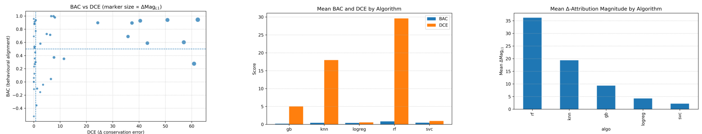

# Delta-Audit 🔀🧭📊

*A lightweight Δ-Attribution suite for auditing model updates (A→B) with behavioural linkage and robustness checks.*

[](https://github.com/arshiahemmat/delta-audit/actions)
[](https://opensource.org/licenses/MIT)
[](https://www.python.org/downloads/)

## Overview

Delta-Audit provides a comprehensive suite of Δ-Attribution metrics to understand how model explanations change when models are updated. It implements behavioural alignment, conservation error, and stability measures to audit model updates across different algorithms and datasets.



## Quickstart

```bash
# Install in a virtual environment
python3 -m venv .venv && source .venv/bin/activate
pip install -e . && pip install -r requirements.txt

# Run a quick demonstration (5 minutes)
delta-audit quickstart

# Run the full benchmark (45 experiments)
delta-audit run --config configs/full_benchmark.yaml

# Generate figures from results
delta-audit figures --summary delta_attr_run/results/_summary --out figures/

# Run sanity checks
delta-audit check
```

## Repository Structure

```
delta-audit/
├── src/delta_audit/          # Main package
│   ├── metrics.py            # Δ-Attribution metrics implementation
│   ├── explainers.py         # Attribution computation methods
│   ├── runners.py            # Training and evaluation pipelines
│   ├── plotting.py           # Figure generation utilities
│   ├── io.py                 # Data loading and saving
│   └── cli.py                # Command-line interface
├── configs/                  # Configuration files
│   ├── quickstart.yaml       # Quick demonstration config
│   └── full_benchmark.yaml   # Full benchmark config
├── delta_attr_run/           # Original experiment structure
│   ├── code/                 # Original scripts (for reproducibility)
│   └── results/              # Results and figures
├── paper/                    # Research paper
│   └── ICCKE_delta.pdf       # NOT AVAILABLE NOW!
├── docs/                     # Documentation website
└── .github/                  # GitHub workflows and templates
```

## Reproducing the Paper

To reproduce all results and figures from the paper:

```bash
# 1. Install dependencies
pip install -e . && pip install -r requirements.txt

# 2. Run the full benchmark (reproduces all 45 experiments)
delta-audit run --config configs/full_benchmark.yaml

# 3. Generate all figures
delta-audit figures --summary delta_attr_run/results/_summary --out delta_attr_run/results/figures/

# 4. Check results
delta-audit check
```

The results will be saved in `delta_attr_run/results/` with the same structure as in the paper.

## Δ-Attribution Metrics

Delta-Audit implements the following metrics:

- **BAC (Behavioral Alignment Coefficient)**: Correlation between attribution change magnitude and output change magnitude
- **DCE (Differential Conservation Error)**: Difference between sum of attribution changes and actual output change
- **Δ Magnitude L1**: L1 norm of attribution differences
- **Δ TopK10**: Fraction of total magnitude captured by top-10 features
- **Δ Entropy**: Entropy of normalized attribution differences
- **Rank Overlap @10**: Overlap between top-10 features of two attribution sets
- **JSD (Jensen-Shannon Divergence)**: Distributional shift between attribution sets
- **COΔF**: Conservation of relevant features for fixes and regressions
- **Δ Stability**: Robustness to input perturbations

## Supported Algorithms

- **Logistic Regression**: Different regularization strengths and solvers
- **Support Vector Classification**: Different kernels and parameters
- **Random Forest**: Different ensemble sizes and feature selection
- **Gradient Boosting**: Different learning rates and tree depths
- **K-Nearest Neighbors**: Different neighbor counts and distance metrics

## Supported Datasets

- **Breast Cancer**: Binary classification (569 samples, 30 features)
- **Wine**: Multi-class classification (178 samples, 13 features)
- **Digits**: Multi-class classification (1797 samples, 64 features)

## Documentation

See the [documentation website](https://arshiahemmat.github.io/delta-audit) for detailed guides:

- [Getting Started](docs/getting-started.md)
- [Concepts](docs/concepts.md)
- [Metrics](docs/metrics.md)
- [API Reference](docs/api.md)
- [CLI Reference](docs/cli.md)
- [Benchmarks](docs/benchmarks.md)

## Citation

If you use Delta-Audit in your research, please cite (Will be available soon!):

```bibtex
@article{hemmat2025delta,
  title={Delta-Audit: Explaining What Changes When Models Change},
  author={Hemmat, Arshia},
  journal={arXiv preprint},
  year={2025}
}
```

## License

This project is licensed under the MIT License - see the [LICENSE](LICENSE) file for details.

## Acknowledgments

Thanks to the open-source community for the excellent tools that made this project possible, particularly scikit-learn, matplotlib, and pandas. 
